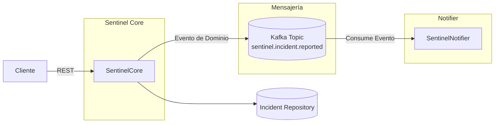

# Sentinel – Sistema Event-Driven de Gestión de Incidentes


## Índice

* [Visión General](#visión-general)
* [Stack Tecnológico](#stack-tecnológico)
* [Arquitectura y Decisiones de Diseño](#arquitectura-y-decisiones-de-diseño)
   * [Arquitectura Hexagonal](#arquitectura-hexagonal-ports--adapters)
   * [Domain-Driven Design](#domain-driven-design-ddd)
   * [Comunicación Event-Driven](#comunicación-event-driven)
   * [Testing](#testing)
* [Cómo ejecutar](#cómo-ejecutar)
* [Mejoras Futuras](#mejoras-futuras)

---

## Visión General

Sentinel es un sistema de gestión de incidentes basado en eventos, diseñado para demostrar cómo construir microservicios desacoplados utilizando:

* **Domain-Driven Design (DDD)**
* **Arquitectura Hexagonal (Ports & Adapters)**
* **Apache Kafka**
* **Docker Compose**

El proyecto simula un escenario realista donde un servicio de dominio publica eventos que otros servicios consumen de forma asíncrona.

---

## Ecosistema

El sistema está compuesto por dos microservicios independientes:

### 🔹 Sentinel Core

* Expone una API REST
* Contiene toda la lógica de dominio
* Publica eventos de integración en Kafka cuando ocurre un incidente

### 🔹 Sentinel Notifier

* Consume eventos desde Kafka
* Reacciona en tiempo real a los incidentes reportados
* Simula un sistema de notificaciones desacoplado

---

## Stack Tecnológico

* **Java 21**
* **Spring Boot 3.5.9**
* **Apache Kafka**
* **Spring Kafka**
* **Maven (multi-módule)**
* **JUnit 5 / Mockito**
* **Embedded Kafka (tests)**
* **Docker & Docker Compose**

---

## Arquitectura y Decisiones de Diseño

El ecosistema Sentinel ha sido diseñado priorizando el desacoplamiento técnico y la integridad del modelo de dominio.


---

### Arquitectura Hexagonal (Ports & Adapters)

Cada microservicio adopta una Arquitectura Hexagonal dividida en tres capas claras:

#### 1️⃣ Domain

* Entidades, Value Objects y reglas de negocio
* Eventos de dominio
* No depende de ninguna librería externa (ni siquiera de Spring)
* Sentinel Notifier no contiene lógica de dominio propia; actúa como un adaptador reactivo que traduce eventos de integración en acciones técnicas (notificaciones).

#### 2️⃣ Application

* Casos de uso
* Puertos de entrada y salida
* Orquesta el flujo del negocio sin conocer detalles de infraestructura

#### 3️⃣ Infrastructure

Implementa los adaptadores técnicos:

  * **Inbound:** API REST con Spring MVC, DTOs y mappers.
  * **Outbound:** Publicación de eventos en Apache Kafka y persistencia (actualmente en memoria, preparada para JPA).

---

### Domain-Driven Design (DDD)

Se han aplicado patrones de DDD para lograr un modelo robusto:

* **Value Objects**
  * Encapsulan inmutables y validaciones, evitando el uso de tipos primitivos y garantizando estados válidos.

* **Aggregates**
  * `Incident` actúa como agregado, controlando su máquina de estados (`IncidentStatus`) y su propio ciclo de vida.

* **Domain Events**
  * El reporte de un incidente genera un evento de dominio sin conocer consumidores externos.

---

### Comunicación Event-Driven

La comunicación entre servicios es asíncrona y desacoplada mediante Apache Kafka.

* **Eventos de Integración**
  * Los eventos de dominio se transforman explícitamente en eventos de integración, protegiendo el dominio ante cambios de contratos externos.

* **Garantías de Mensajería**
  * Kafka se utiliza con semántica **at-least-once delivery**.
  * Las claves de los mensajes se basan en `IncidentId` para preservar el orden por agregado y facilitar consumidores idempotentes.

* **Perfiles de Ejecución**
  * El sistema soporta múltiples perfiles (`dev`, `test`, `kafka`), permitiendo:

    * Eventos internos de Spring para desarrollo rápido.
    * Kafka real para escenarios productivos.

---

### Testing

* **Tests de Dominio puros**
  * Cobertura completa de reglas de negocio y Value Objects.

* **Tests de Integración de API REST**
  * Uso de `@WebMvcTest` para validar contratos REST y manejo global de errores.

* **Tests de Mensajería**
  * Publicación y consumo real con `@EmbeddedKafka`, validando serialización y flujo de eventos.

---

## Cómo ejecutar

### Requisitos

* Docker
* Docker Compose v2+

> 💡 No es necesario tener Java ni Maven instalados localmente.

---
### Clonar el repositorio

```bash
git clone https://github.com/Jherna77/event-driven-microservices.git
cd event-driven-microservices
```

---

### Levantar todo el ecosistema

Desde la raíz del proyecto:

```bash
docker compose up -d --build
```

Esto iniciará automáticamente:

* Zookeeper
* Kafka
* Kafdrop (UI)
* Sentinel Core
* Sentinel Notifier

---

### Servicios disponibles

| Servicio          | URL                                            |
| ----------------- | ---------------------------------------------- |
| Sentinel Core API | [http://localhost:8080](http://localhost:8080) |
| Sentinel Notifier | [http://localhost:8081](http://localhost:8081) (Solo endpoints técnicos – Actuator) |
| Kafdrop           | [http://localhost:9000](http://localhost:9000) |

---

### Documentación de la API

El servicio **Sentinel Core** incluye documentación interactiva mediante Swagger/OpenAPI. Una vez que el ecosistema esté levantado, se puede acceder a ella para explorar y probar los endpoints:

* **Swagger UI**: [http://localhost:8080/swagger-ui.html](http://localhost:8080/swagger-ui.html)
* **OpenAPI Spec (JSON)**: [http://localhost:8080/v3/api-docs](http://localhost:8080/v3/api-docs)

Esta documentación se genera automáticamente a partir de los controladores y DTOs, garantizando que el contrato siempre esté actualizado con el código.

---
### Observabilidad y Health Checks

Aunque Sentinel Notifier es un microservicio puramente event-driven y no expone APIs REST de negocio, el sistema ha sido diseñado siguiendo principios de observabilidad y operabilidad en producción, permitiendo integrar fácilmente health checks para mejorar la capacidad de monitorización.

Por este motivo, se mantiene un servidor HTTP activo únicamente para exponer los siguientes endpoints técnicos mediante Spring Boot Actuator:

| Endpoint                     | Propósito                                                 |
| ---------------------------- | --------------------------------------------------------- |
| [http://localhost:8081/actuator/health](http://localhost:8081/actuator/health)           | Estado general del servicio                               |
| [http://localhost:8081/actuator/health/liveness](http://localhost:8081/actuator/health/liveness)  | Verifica que el proceso está activo                       |
| [http://localhost:8081/actuator/health/readiness](http://localhost:8081/actuator/health/readiness) | Verifica que el servicio está listo para consumir eventos |
| [http://localhost:8081/actuator/info](http://localhost:8081/actuator/info)             | Información básica del microservicio                      |

---

### Probar el flujo completo end-to-end

Esta prueba permite validar el flujo completo del sistema, desde la creación de un incidente vía API REST hasta su procesamiento asíncrono por parte de un consumidor Kafka.

#### 1️⃣ Crear un incidente (API REST)

El servicio Sentinel Core expone una API REST que actúa como punto de entrada al sistema y que está documentada mediante Swagger/OpenAPI.

  1. Acceder a [Swagger UI](http://localhost:8080/swagger-ui.html)
  2. Localizar el endpoint POST `/incidents`
  3. Pulsar Try it out y utilizar el siguiente payload de ejemplo:
  ```json
    {
      "title": "Fallo de conexion en BD",
      "description": "El pool de conexiones ha alcanzado su limite maximo",
      "severity": "HIGH"
    }
  ```
  4. Ejecutar la petición

<p align="center">

</p>

#### 2️⃣ Qué ocurre internamente

Tras recibir la petición:

1. Sentinel Core

   * Valida la entrada
   * Ejecuta la lógica de dominio
   * Persiste el incidente (actualmente en memoria)
   * Genera un evento de dominio

2. Publicación del evento

   * El evento de dominio se transforma en un evento de integración
   * Se publica en Kafka en el tópico `sentinel.incident.reported`

3. Sentinel Notifier

   * Consume el evento desde Kafka
   * Reacciona de forma asíncrona
   * Simula el envío de una notificación

Este flujo demuestra una comunicación desacoplada y orientada a eventos.

#### 3️ Resultado esperado

* En Swagger debería recibirse una respuesta HTTP `201 Created`

<p align="center">

</p>

* Consultando el log del consumidor (Sentinel Notifier)

  ```bash
  docker logs -f event-driven-microservices-sentinel-notifier-1
  ```

  , debería aparecer una entrada similar a:

  ```
  NOTIFICATION: Incident [Fallo de conexión en BD] with severity [HIGH]
  ```

#### 4️⃣ Validaciones adicionales

* Inspeccionar el evento en Kafka accediendo a [Kafdrop](http://localhost:9000)

  * Ver el tópico `sentinel.incident.reported`
  * Inspeccionar el mensaje publicado por Sentinel Core

<p align="center">

</p>

* Verificar el estado del consumidor

  ```text
  http://localhost:8081/actuator/health
  ```

---

### Detener y limpiar entorno

```bash
docker compose down -v
```
<!--
---

## Mejoras Futuras

* Versionado de eventos (`IncidentReportedV1`)
* Dead Letter Topics (DLQ)
* Consumidores idempotentes
* Persistencia con PostgreSQL
* Correlation IDs y trazabilidad distribuida
* Observabilidad (metrics + tracing)
-->

